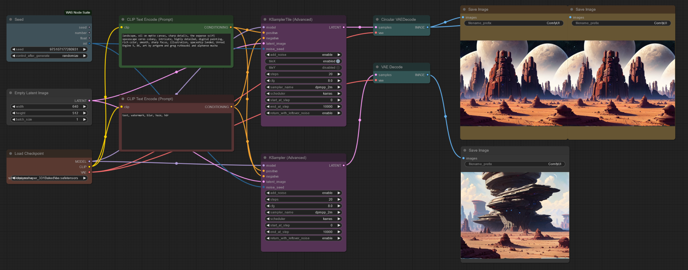

# KSampler Advanced Tile

This node introduces enhancements to the KSamplerAdvanced node by adding tiling functionality. The key changes are encapsulated in two new classes: `KSamplerAdvancedTile` and `CircularVAEDecode`.

1. **KSamplerAdvancedTile**: This class brings in the capability to handle tiling along the X and Y axes independently. It includes methods for setting layer padding based on tiling parameters, applying asymmetric tiling to all convolutional layers, hijacking and restoring Conv2d methods for customized forward passes, and a tailored sampling method that accounts for tiling preferences, noise addition, and denoise levels.

2. **CircularVAEDecode**: A class that extends VAEDecode, introducing circular padding for Conv2d layers during the decoding process.

## Key Features

- Asymmetric tiling support for more flexible image sampling.
- Dynamic adjustment of convolutional layer padding based on tiling preferences.
- Enhanced control over noise addition and denoising in the sampling process.

These enhancements aim to improve the flexibility and performance of the KSampler node, particularly in applications requiring fine-tuned control over image generation processes. The changes are backward compatible and maintain the existing functionality of the KSampler node.

## Usage

> Don't forget to CircularVAEDecode as decoder.
>

